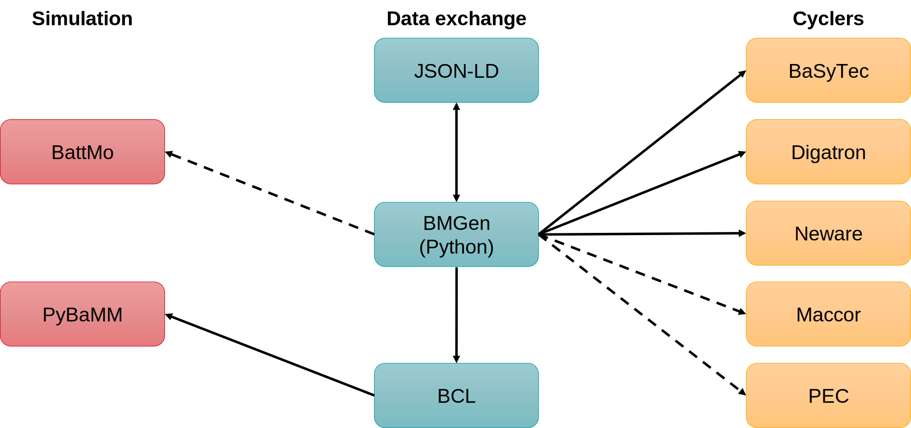

Cycling Languages
=================

The currently supported languages include:

- Battery Manager
- Neware
- Basytec
- JSON-LD ([https://json-ld.org/])
- BCL ([https://github.com/phdechent/BCL])

The following table gives an overview over the features available in each language:

|                                                   | Battery Manager            | Neware | BasyTec |
| ------------------------------------------------- | -------------------------- | ------ | ------- |
| charge/discharge/pause                            | ✔️                         | ✔️    | ✔️      |
| limits (global and for individual steps)          | ✔️                         | ✔️    | ✔️      |
| registrations (global)                            | ✔️                         | ✔️    | ✔️      |
| registrations (for individual steps)              | ✔️                         | ✔️    | ✔️      |
| variables in the generated program                | ✔️                         | ➖    | ❌      |
| battery parameters                                | ✔️                         | ➖    | ✔️      |
| if / else statements                              | ✔️                         | ✔️    | ❌      |
| if / else statements (compile time)               | ❌                         | ✔️    | ✔️      |
| loops with fixed cycle count                      | ✔️                         | ✔️    | ❌      |
| loops with arbitrary conditions                   | ✔️                         | ➖    | ❌      |
| loops (compile time)                              | ❌                         | ✔️    | ✔️      |
| references to duration/Ah count of previous steps | ✔️                         | ✔️    | ✔️      |
| calculations in the generated program             | ✔️                         | ➖    | ❌      |
| array constants                                   | ✔️                         | ➖    | ➖      |
| array constants (compile time)                    | ❌                         | ✔️    | ✔️      |
| mutable arrays                                    | ✔️                         | ➖    | ➖      |

✔️ implemented
❌ planned
➖ not supported by the target