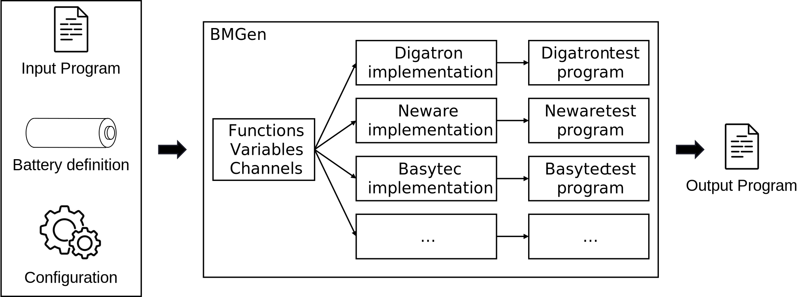
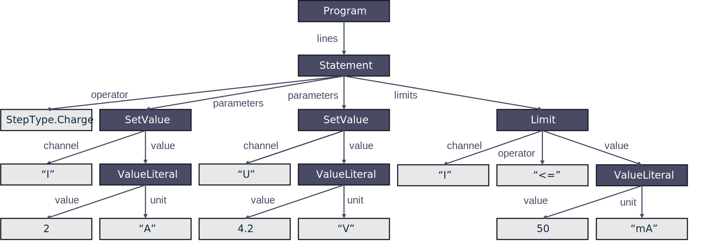
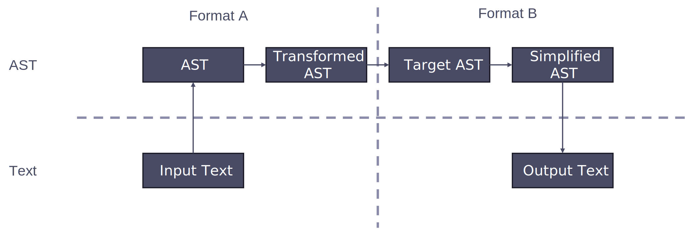

Structure
=========

The general structure of BMGen is that a cycling program written in Python is given.
This can be combined with a battery definition if battery parameters should be substituted in the program and a config file to specify options for the program generation.
The Python program is run within BMGen and translated to another cycling language depending on the chosen target. The result is exported to a file that can be read by the specified cycler's software.

The underlying conpect relies on parsing cycling programs into an AST (Abstract Syntax Tree) that represents the structure of the program.
An example AST is shown in this figure:

Once the AST is built, it can be modified and transformed into another language. In BMGen, this happens in three steps:
First, some transformations are applied to handle constructs like if statements and loops, so that they are not executed directly in Python but instead translated to the cycler language.
Then the program is run and a new AST is built in the target cycling language. This AST is then simplified, for example by combining multiple steps into one if possible.
Finally, the simplified AST is serialized into a file format understood by the cycler.

